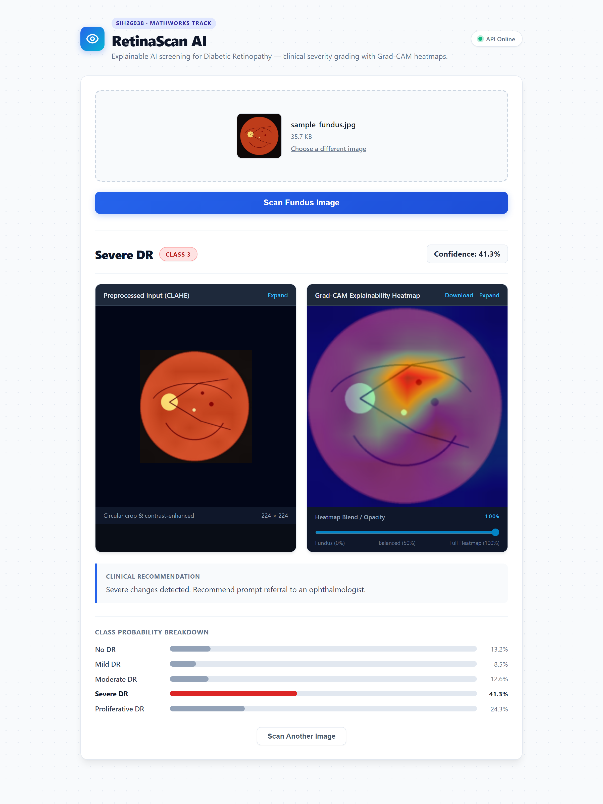

# RetinaScan AI

**Explainable AI Screening for Diabetic Retinopathy in Rural India**

An automated, trust-centered clinical decision support tool that grades Diabetic Retinopathy (DR) severity from digital retinal fundus photographs and visualizes pathological drivers via **Grad-CAM** saliency heatmaps—transforming black-box predictions into actionable, explainable insights for clinicians and primary healthcare workers.

---

## 1. Project Information

- **Project Title:** RetinaScan AI
- **Problem Statement ID:** SIH26038
- **Problem Statement Title:** Explainable AI for Diabetic Retinopathy Screening in Rural India
- **Category:** Software
- **Theme:** MedTech / BioTech / HealthTech
- **Sponsor:** MathWorks
- **Team ID:** 110084
- **Team Name:** Beta Alanine
- **Team Members:** Tushar, Sahil, Shaurya, Sazid, Ayush, Parshvi

---

## 2. Problem Statement

Diabetic Retinopathy is one of the leading causes of preventable adult blindness globally. In rural India, over 70 million individuals live with diabetes, yet access to trained ophthalmologists is severely constrained, with doctor-to-patient ratios exceeding 1:100,000 in remote districts. 

Early-stage DR is largely asymptomatic, and patients often seek medical care only after irreversible vision loss has occurred. While standard Deep Learning models can classify fundus images, their "black box" nature prevents clinicians and primary healthcare workers from trusting the diagnosis. Health workers need to see *why* an AI made a recommendation before referring patients for urgent clinical intervention.

---

## 3. Proposed Solution

**RetinaScan AI** provides an end-to-end, explainable screening workflow:

1. **Contrast & Geometry Normalization:** Raw fundus images undergo circular masking and Contrast Limited Adaptive Histogram Equalization (CLAHE) to mitigate uneven illumination and lighting variations across cameras.
2. **Deep Learning Classification:** An **EfficientNet-B0** convolutional neural network, fine-tuned on the APTOS 2019 dataset using weighted cross-entropy loss, grades severity across the 5 International Clinical Diabetic Retinopathy (ICDR) stages.
3. **Transparent Explainability:** Real-time **Grad-CAM** (Gradient-weighted Class Activation Mapping) generates visual attention heatmaps highlighting specific pathological features (microaneurysms, hemorrhages, hard/soft exudates).
4. **Interactive Clinical Web Interface:** A lightweight, single-page interface with an interactive heatmap opacity blend slider, per-class probability distribution, and stage-specific clinical recommendations.

---

## 4. Key Features

- **Automated 5-Stage ICDR Grading:** Classifies fundus images into No DR (0), Mild (1), Moderate (2), Severe (3), and Proliferative DR (4).
- **Grad-CAM Saliency Visualization:** Pinpoints the exact anatomical regions driving the network's diagnosis.
- **Interactive Opacity Blend Slider:** Allows clinicians to continuously fade between the enhanced fundus image and the explainability heatmap.
- **Confidence Scoring & Probabilities:** Full probability distribution across all five severity stages.
- **Standardized Clinical Recommendations:** Practical triage advice guiding primary health center workers on re-screening intervals or urgent ophthalmology referrals.
- **Single-Origin Cloud Serving:** Unified FastAPI backend that serves both API endpoints and the static frontend from a single web service.

---

## 5. Technology Stack

- **Deep Learning Framework:** PyTorch, Torchvision
- **Explainability:** Grad-CAM (Targeting final convolutional block of EfficientNet-B0)
- **Image Processing:** OpenCV (`opencv-python-headless`), Pillow, NumPy
- **Backend API:** FastAPI, Uvicorn, Python Multipart
- **Frontend:** HTML5, Modern CSS3, Vanilla JavaScript (Zero build step, zero heavy client framework)
- **Deployment Platform:** Render (Free tier, native Python environment)
- **Containerization:** Docker (`python:3.10-slim`, CPU-optimized wheels)

---

## 6. Architecture

See [docs/architecture.md](docs/architecture.md) for full technical documentation and [docs/decisions/](docs/decisions/) for Architecture Decision Records (ADRs).

```text
[Fundus Image Upload]
         │
         ▼
[CLAHE Preprocessing & Circular Masking]
         │
         ▼
[EfficientNet-B0 Deep CNN Classifier]
   ┌─────┴─────────────────────────┐
   ▼                               ▼
[ICDR Severity Grade & Conf]    [Grad-CAM Saliency Engine]
   └─────┬─────────────────────────┘
         ▼
[FastAPI REST Response (/predict)]
         │
         ▼
[Unified Responsive Web Frontend]
```

---

## 7. Repository Structure

```text
retinascan-ai/
├── README.md                          # Main project documentation (SIH 2026 format)
├── SUBMISSION_GUIDE.md                # Official submission checklist & guidelines
├── LICENSE                            # MIT License
├── submission/
│   ├── PRESENTATION.md                # Presentation documentation & links
│   ├── DEMO.md                        # Demo video documentation & links
│   └── BetaAlanine_SIH2026_Presentation.pptx  # Final 6-page submission presentation
├── demo.mp4                           # Project demonstration video with voiceover
├── docs/
│   ├── architecture.md                # Detailed pipeline & model architecture
│   ├── deployment.md                  # Cloud deployment & hosting instructions
│   └── decisions/                     # Architecture Decision Records (ADRs)
│       ├── 0001-model-stack-python-vs-matlab.md
│       └── 0002-dataset-choice.md
├── assets/
│   └── screenshots/                   # Application screenshots & UI views
│       ├── README.md
│       └── 01-screening-ui.png
├── backend/
│   └── app/
│       ├── main.py                    # FastAPI server & static file mounting
│       └── inference.py               # Model loading, prediction, & Grad-CAM pipeline
├── frontend/
│   └── index.html                     # Single-file interactive diagnostic web app
├── model/
│   ├── preprocess.py                  # CLAHE & circular crop implementations
│   ├── train.py                       # EfficientNet-B0 training script
│   └── gradcam.py                     # Heatmap overlay generator
├── data/
│   └── README.md                      # Dataset acquisition & directory instructions
├── Dockerfile                         # Cloud container deployment configuration
└── requirements.txt                   # Verified project dependencies
```

### What goes where?

| Item | Location | Description |
|---|---|---|
| Final Presentation | [Google Drive Slides](https://docs.google.com/presentation/d/11kcs6WbC7Omp3oKMptgNJXTZNqfDYaj1/edit?usp=sharing&ouid=112337875314343648118&rtpof=true&sd=true) / `submission/` | Official 6-page presentation (`BetaAlanine_SIH2026_Presentation.pptx`) |
| Demo Video | [Google Drive Video](https://drive.google.com/file/d/16wWaZko3v8RjWtXLJfv3Y7vmWDPnVKZN/view?usp=drive_link) / `demo.mp4` | Recorded demonstration video with voiceover |
| Source Code | `backend/`, `model/`, `frontend/` | Complete, verified, working application source |
| Architecture & ADRs | `docs/` | Pipeline flow diagrams and design decisions |
| Application Screenshots | `assets/screenshots/` | Working UI and Grad-CAM output captures |
| Setup & Run Guide | `README.md` | Step-by-step local execution instructions |

---

## 8. Final Presentation

The official 6-page SIH pitch deck is available on Google Drive and in the `submission/` directory:

- **Google Drive Presentation (PPTX / Slides):** [View Presentation on Google Drive](https://docs.google.com/presentation/d/11kcs6WbC7Omp3oKMptgNJXTZNqfDYaj1/edit?usp=sharing&ouid=112337875314343648118&rtpof=true&sd=true)
- **Direct PPTX File:** [submission/BetaAlanine_SIH2026_Presentation.pptx](submission/BetaAlanine_SIH2026_Presentation.pptx)
- **Presentation Details:** [submission/PRESENTATION.md](submission/PRESENTATION.md)

---

## 9. Demo Video

A full voiceover demonstration of the working system is available on Google Drive and in the repository:

- **Google Drive Demo Video:** [Watch Demo Video on Google Drive](https://drive.google.com/file/d/16wWaZko3v8RjWtXLJfv3Y7vmWDPnVKZN/view?usp=drive_link)
- **Live Interactive App:** [https://retinascan-ai-73ss.onrender.com](https://retinascan-ai-73ss.onrender.com)
- **Repository Video File:** [demo.mp4](demo.mp4)
- **Demo Video Guide:** [submission/DEMO.md](submission/DEMO.md)

---

## 10. Screenshots / Prototype Photos

Screenshots of the working prototype are located in [`assets/screenshots/`](assets/screenshots/):



*Diagnostic Dashboard: Input fundus photograph with CLAHE preprocessing, Class 2 (Moderate DR) severity classification (96.9% confidence), Grad-CAM explainability heatmap with live opacity slider, clinical triage recommendation, and full 5-stage probability breakdown.*

---

## 11. Installation

### Prerequisites
- Python 3.10 or 3.11
- Git

### Setup Instructions

```bash
# Clone the repository
git clone https://github.com/stoic-bruh/retinascan-ai.git
cd retinascan-ai

# Create and activate virtual environment
python -m venv venv
# On Windows:
venv\Scripts\activate
# On Linux/macOS:
source venv/bin/activate

# Install dependencies
pip install -r requirements.txt
```

---

## 12. Run

### Local Execution

```bash
# Terminal 1 — Start the unified FastAPI backend (also serves the frontend)
cd backend
uvicorn app.main:app --reload --port 8000

# Open in your browser:
# http://localhost:8000
```

*Alternatively, if running the frontend via a separate dev server:*
```bash
# Terminal 2 (Optional) — Run frontend independently
cd frontend
python -m http.server 5500
# Open http://localhost:5500
```

---

## 13. Live Deployment

- **Live Web Application & API:** **[https://retinascan-ai-73ss.onrender.com](https://retinascan-ai-73ss.onrender.com)**

> [!TIP]
> **Render Free Tier Warm-up**:
> Free instances spin down during periods of inactivity. If visiting after idle time, please allow 30–50 seconds for the service container to wake up.

---

## 14. Future Scope

1. **Batch Camp Screening Mode:** Enabling rural health workers to queue multiple fundus images during community camps and generate aggregate triage registries.
2. **Smartphone Indirect Ophthalmoscopy:** Integrating lightweight on-device quantization (ONNX / INT8) for handheld mobile lens attachments.
3. **Multi-Lesion Segmentation:** Advancing from heatmaps to precise lesion boundary segmentation (hard exudates vs microaneurysms) using IDRiD annotations.

---

## Submission Checklist

- [x] 6-page PPT (`submission/BetaAlanine_SIH2026_Presentation.pptx`)
- [x] Demo video with voiceover (`demo.mp4` / `submission/DEMO.md`)
- [x] Working code (verified PyTorch model + Grad-CAM + FastAPI backend + UI)
- [x] Live deployment link ([https://retinascan-ai-73ss.onrender.com](https://retinascan-ai-73ss.onrender.com))
- [x] Documentation & repository aligned with NSUT SIH reference template
