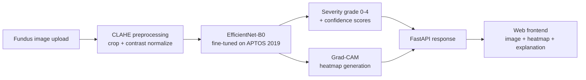

# Architecture

## Data flow

## Model
- Backbone: EfficientNet-B0, ImageNet-pretrained, fine-tuned end-to-end.
- Loss: weighted cross-entropy (class weights from `sklearn.compute_class_weight`)
  to correct APTOS's imbalance toward "No DR".
- Input: 224x224 RGB, CLAHE-normalized.

## Explainability
- Grad-CAM on the last convolutional block of EfficientNet-B0.
- Validated qualitatively against IDRiD lesion masks — heatmap activation
  should overlap with annotated microaneurysms/hemorrhages/exudates, not
  random background.

## Serving
- FastAPI exposes a single `/predict` endpoint (multipart image upload →
  JSON response with grade, confidence, per-class probabilities, base64
  processed image, base64 heatmap overlay).
- Frontend is a static single-file HTML/JS page — no build step, easy to
  demo from any machine.

## Deployment
- Backend: Render (free tier) — see README for live URL.
- Model checkpoint loaded once at startup, kept in memory for the process
  lifetime (no per-request disk I/O).
